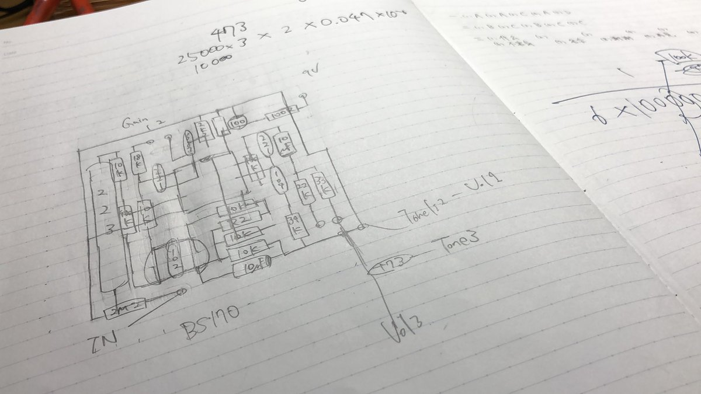
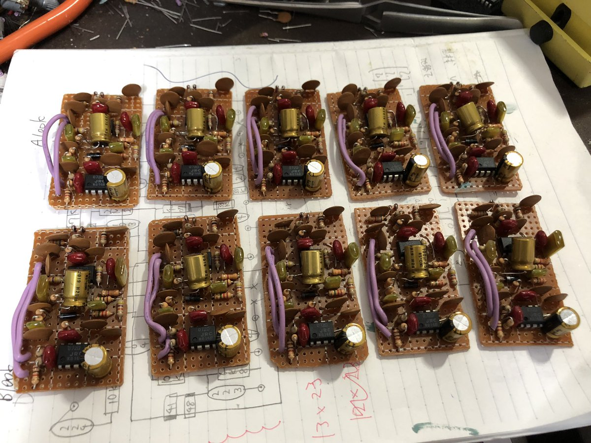
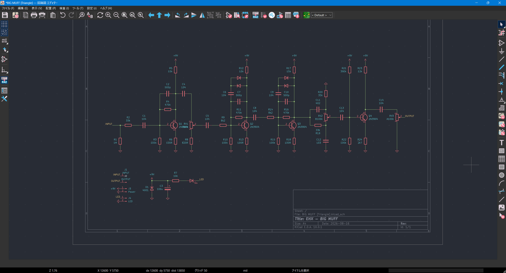
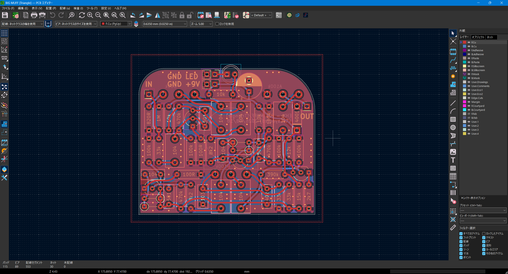
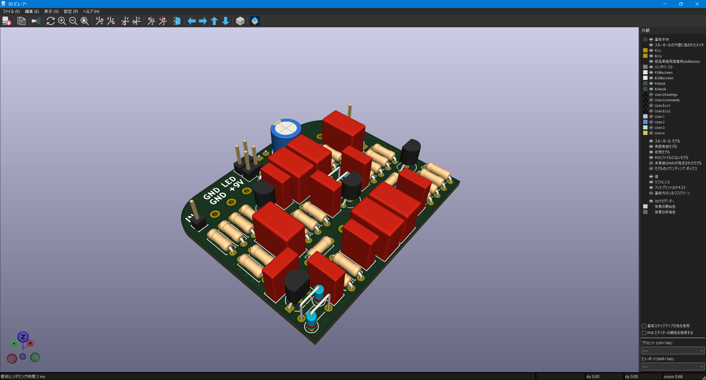
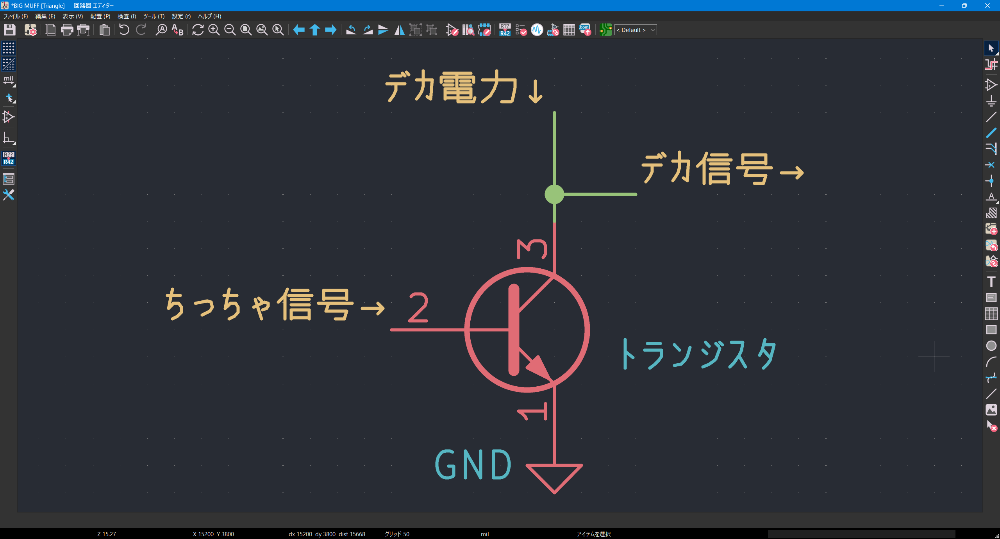

私の人生２作目 →

 

# まずは基板から

 

---
layout: two-cols
title: 基板の種類
---

::left::

## ユニバーサル基板

古き良き愛すべきもの

	

いま絶対こんなことできない、若かった…↓

	

::right::

## PCB基板

配線パターンが予め敷かれているので、 部品を取り付けるだけでよい

	

	
	

設計・発注の流れについては、 エフェクター作ろ概論Ⅱを受講してください

---
layout: two-cols
title: 登場人物紹介
---

::left::

## 抵抗 🤜🤛

- 単位はオーム \[$\mathrm{Ω}$\]
- 基板上での表記：`〇〇 R` / `〇〇 k` / `〇〇 M`

## コンデンサ 🔋

	
	
	

- 単位はファラド \[$\mathrm{F}$\]
- 基板上での表記：数字3桁（`104`とか） / `〇〇u`
- いくつか種類がある
  - 向きが決まっているものもある！

::right::

## ダイオード ⛔

  
  
  

- 電流を一方向にしか流さない
- 基板上での表記：なんかこんな感じ `-[|  ]-`

## トランジスタ / FET/ IC 🪨

	
	
	

- 電気信号を増幅する
- アクティブ（能動）素子

 

画像：<a href="https://akizukidenshi.com/">秋月電子通商HP</a>より

---
layout: two-cols
title: 知っておこう
---

::left::

## 信号はいかにデカくなる？

 

### ✖ 入ってきた信号が そのままデカくなって出ていく

 

### ⭕ 供給されたデカい電力が 入ってきた信号を真似て出ていく

 

::right::

## 基板を作るときのコツ

 

- 背の低い部品から実装する
	- 抵抗やダイオードが先、コンデンサは後
- ICやトランジスタはソケットを使う
	- 熱に弱いので壊しやすい

	
	

 

- （余裕があれば）見た目のきれいさを意識する

 

<v-click>

### レッツゴー

#### 分かんなくなったら訊いてください

</v-click>