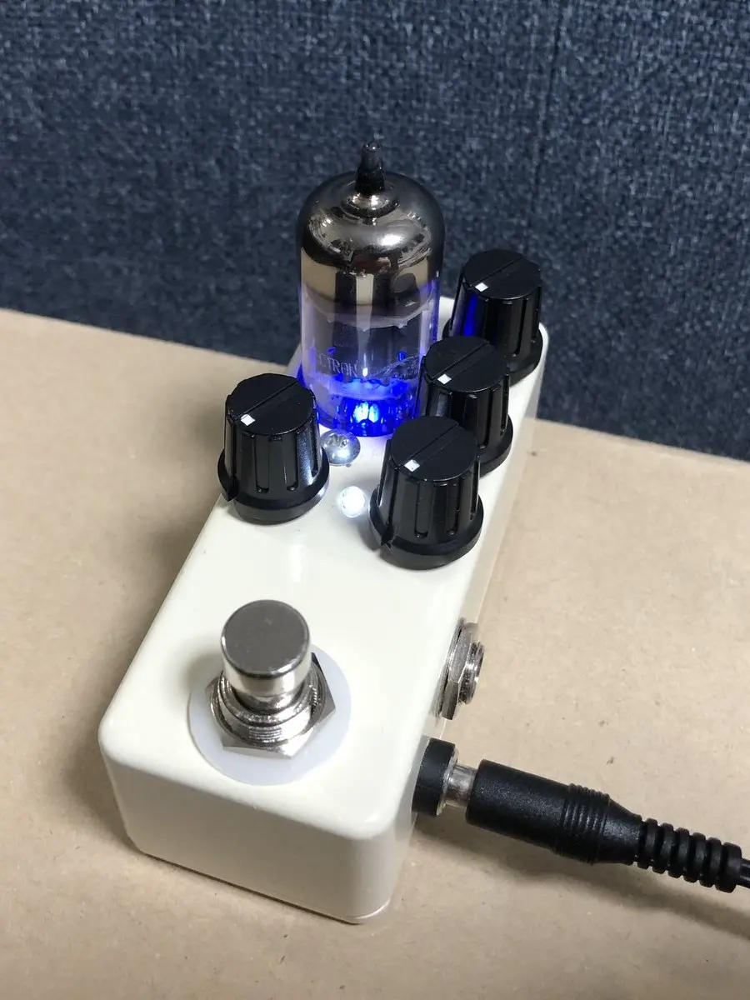
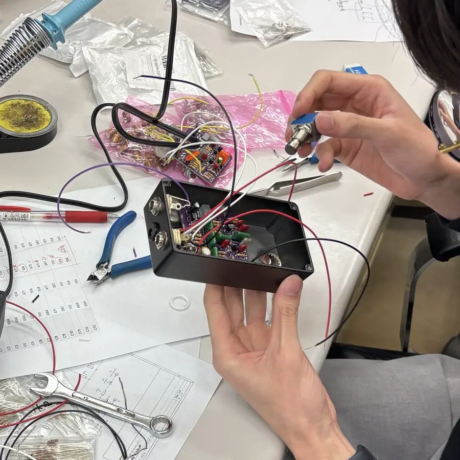

::left::

SDGs 999：ミニケースに真空管を載せよう

      

# 音出し、あわよくば完成

::right::

  

---

# 音出し

 

## 無事に鳴った人：まずはおめでとう🎉

適宜ホットボンドで固めて、裏蓋にサインを書こう

 

## 鳴らなかった人：エフェクター作り本編のスタート😍

テスターとワニ口クリップでデバッグしよう

詳しくはエフェクター作ろ特論を受講してください

---

# お疲れ様でした

 

自分のはんだづけした小さな部品一つ一つを音が通って出ていって、

さらにそれを演奏すると皆さまのお耳に入っていくのですごい

大変アツくてワロタ　と常日頃より思っています

 

ハードウェアを作る楽しさが少しでも伝わったなら幸いです！

---
layout: two-cols
hideInToc: true
---

::left::

       

# おしまい

::right::

  

