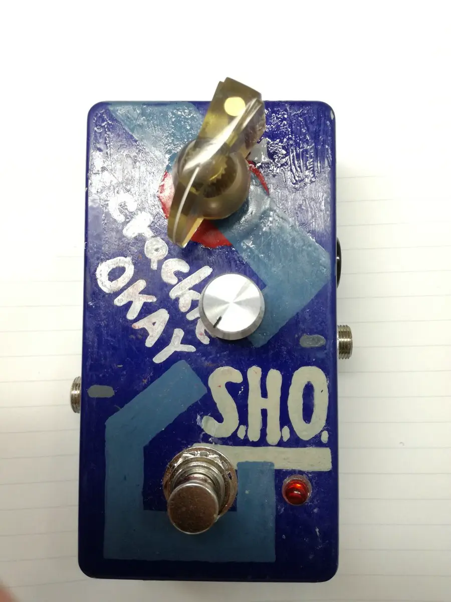

# エフェクター作ろ概論 I

## ~ アナログエフェクターの製作 ~

 

### `v2026-08-25` maintained [HERE](https://github.com/asumo-1xts/Slidev-Theater)

### by https://asumo.dev/

---
layout: two-cols
hideInToc: true
---

::left::

私の人生１作目 

 

# 目次

<Toc/>

::right::

  

---
src: ./01-intro.md
---

---
src: ./02-kiban.md
---

---
src: ./03-wiring.md
---

---
src: ./04-outro.md
---